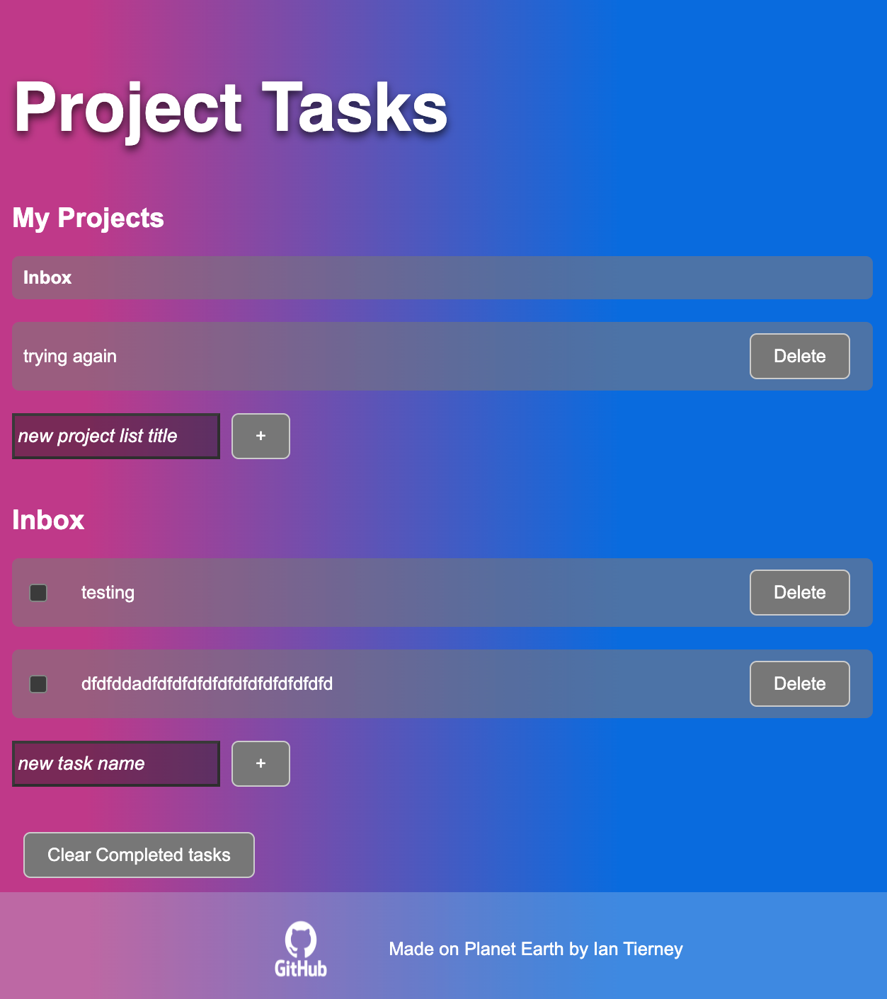

## Todo List Project

This project was inspired by the Model View Controller design strategy for decoupling code. 

This project allows the user to add multiple project lists and to have tasks associated with each of those projects. The user may check tasks off and clear completed tasks. The user can delete project lists and project tasks. Upon refresh, the same tasks load again using local storage. 

### Screenshot of mobile view
